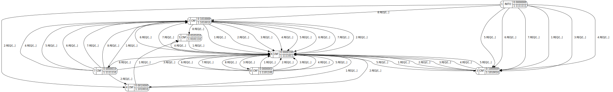
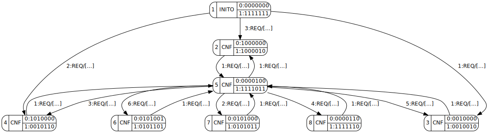
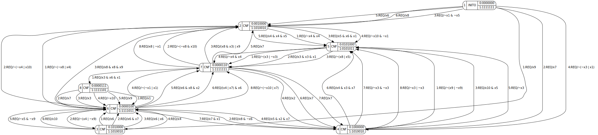
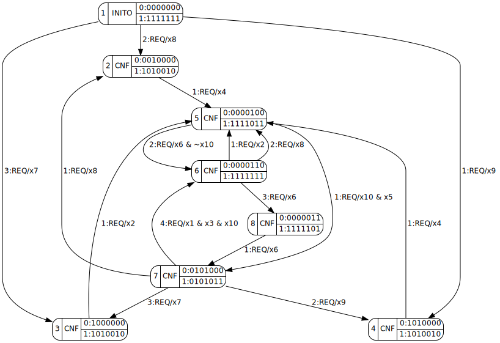
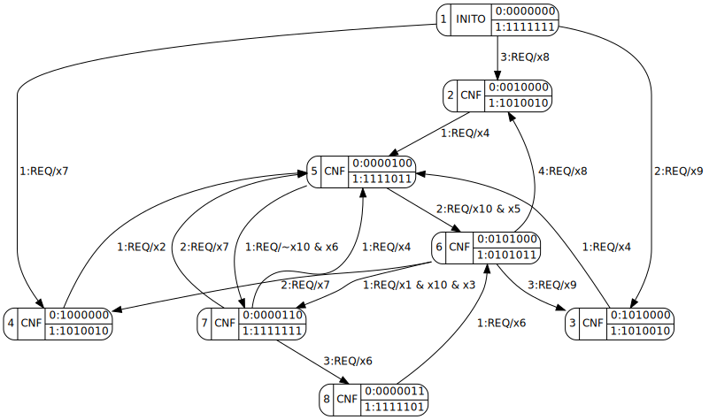

# fbSAT

Automatic Inference and Generalization of Function Block Finite-State Models


## Requirements

* Python 3.6+
* lxml
* regex
* click
* treelib (only available on PyPI)
* colorama (on Windows)
* SAT solver, e.g., [cryptominisat](https://github.com/msoos/cryptominisat)


## Installation

Simply clone and use [pip](https://pip.pypa.io/en/stable/quickstart):

```
git clone https://github.com/ctlab/fbSAT
cd fbSAT
pip install .
```


## Usage

<details>
<summary><b><code>fbsat --help</code></b></summary>

    Usage: fbsat [OPTIONS]

    Options:
      -i, --scenarios <path>          File with scenarios  [required]
      -o, --outdir <path>             Output directory  [default: out]
      -m, --method [full|full-min|basic|basic-min|extended|extended-min|extended-min-ub|minimize]
                                      Method to use  [required]
      --input-names <x.../path>       Comma-separated list of input variable names, or a filename
      --output-names <z.../path>      Comma-separated list of output variable names, or a filename
      --automaton <path>              [minimize] File with pickled automaton
      -C <int>                        Number of automaton states
      -K <int>                        Maximum number of transitions from each state
      -P <int>                        Maximum number of nodes in guard's boolean formula's parse tree
      -T <int>                        Upper bound on total number of transitions
      -N <int>                        Upper bound on total number of nodes in all guard-trees
      -w <int>                        [ext-min-ub] Maximum width of local minima
      --bfs / --no-bfs                Use BFS symmetry-breaking constraints  [default: True]
      --distinct / --no-distinct      Distinct transitions  [default: False]
      --forbid-or / --no-forbid-or    [ext] Forbid OR parse tree nodes  [default: False]
      --sat-solver <cmd>              SAT solver  [default: cryptominisat5 --verb=0]
      --incremental                   Use IncrementalSolver backend
      --filesolver                    Use FileSolver backend
      --version                       Show the version and exit.
      -h, --help                      Show this message and exit.

</details>


## SAT solver

**fbSAT** is able to use any SAT solver, supporting DIMACS input. You can specify it with `--sat-solver <cmd>` flag.

If you already have your favorite SAT solver, use it. If not, check out [cryptominisat](https://github.com/msoos/cryptominisat), [glucose](http://www.labri.fr/perso/lsimon/glucose), [cadical](http://fmv.jku.at/cadical), [lingeling](http://fmv.jku.at/lingeling), or any other.

### Cryptominisat

In order to get cryptominisat, simply download one of [released binary](https://github.com/msoos/cryptominisat/releases) for Linux/Windows.

Moreover, you may even use [docker container](https://hub.docker.com/r/msoos/cryptominisat):

```
docker pull msoos/cryptominisat
cat myfile.cnf | docker run --rm -i msoos/cryptominisat
fbsat ... --sat-solver "docker run --rm -i msoos/cryptominisat"
```

However, a relatively large launch time of the container (up to 2 seconds on Win) can lead to undesirable large total execution time, since fbSAT makes multiple calls to the SAT solver.
The solution is to spawn a container only once, in [detached mode](https://docs.docker.com/engine/reference/run/#detached--d), and later [exec](https://docs.docker.com/engine/reference/commandline/exec) cryptominisat in it when necessary:

```
docker run -d -i --name cms --entrypoint="/bin/sh" msoos/cryptominisat
fbsat ... --sat-solver "docker exec -i cms /usr/local/bin/cryptominisat5 --verb=0"
# When finished, do not forget to stop and remove the spawned container:
docker stop cms
docker rm cms
```


## Methods

### Basic method

This is the most basic and core method. It has one required parameter - number of states (`-C <int>`), and it infers some basic automaton with an arbitrary number of transitions.
In order to upper-bound the latter, use option `-T <int>`.

<details>
<summary><b><code>fbsat -i tests/simple/tests-1.gz -m basic -C 6</code></b></summary>

    [+] Basic automaton:
      ┌─1/INITO(0:0000000, 1:1111111)
      ├──1 to 3 on REQ if [xxxxxxxxxxxxxxxxxxxxxxxxxxxxxxxxxx0x001]
      ├──1 to 4 on REQ if [xxxxxxxxxxxxxxxxxxxxxxxxxxxxxxxxxx0x01x]
      ├──1 to 3 on REQ if [xxxxxxxxxxxxxxxxxxxxxxxxxxxxxxxxxx0x0xx]
      ├──1 to 3 on REQ if [xxxxxxxxxxxxxxxxxxxxxxxxxxxxxxxxxx0x0xx]
      ├──1 to 3 on REQ if [xxxxxxxxxxxxxxxxxxxxxxxxxxxxxxxxxx0x0xx]
      ├──1 to 3 on REQ if [xxxxxxxxxxxxxxxxxxxxxxxxxxxxxxxxxx0x0xx]
      ├──1 to 3 on REQ if [xxxxxxxxxxxxxxxxxxxxxxxxxxxxxxxxxx0x0xx]
      └──1 to 2 on REQ if [xxxxxxxxxxxxxxxxxxxxxxxxxxxxxxxxxx0x1xx]
      ┌─2/CNF(0:1010000, 1:1010010)
      ├──2 to 6 on REQ if [x0xx0x00x0x000xxxxxxxx0xxxxxxxxxxxxx00x]
      ├──2 to 6 on REQ if [x0xx0x00x0x000xxxxxxxx0xxxxxxxxxxxxx00x]
      ├──2 to 6 on REQ if [x0xx0x00x0x000xxxxxxxx0xxxxxxxxxxxxx00x]
      ├──2 to 6 on REQ if [x0xx0x00x0x000xxxxxxxx0xxxxxxxxxxxxx00x]
      ├──2 to 6 on REQ if [x0xx0x00x0x000xxxxxxxx0xxxxxxxxxxxxx00x]
      ├──2 to 6 on REQ if [x0xx0x00x0x000xxxxxxxx0xxxxxxxxxxxxx00x]
      ├──2 to 6 on REQ if [x0xx0x00x0x001xxxxxxxx0xxxxxxxxxxxxx00x]
      └──2 to 5 on REQ if [x0xx0x00x0x01xxxxxxxxxxxxxxxxxxxxxxx0xx]
      ┌─3/CNF(0:1000000, 1:1010010)
      ├──3 to 6 on REQ if [x0xx0000x0x0xx0x0x001x0xxxxxxxxxxxxx000]
      ├──3 to 6 on REQ if [x0xx0000x0x0xx0x0x00xx0xxxxxxxxxxxxx000]
      ├──3 to 6 on REQ if [x0xx0000x0x0xx0x0x00xx0xxxxxxxxxxxxx000]
      ├──3 to 6 on REQ if [x0xx0000x0x0xx0x0x00xx0xxxxxxxxxxxxx000]
      └──3 to 6 on REQ if [x0xx0000x0x0xx0x0x00xx0xxxxxxxxxxxxx000]
      ┌─4/CNF(0:0010000, 1:1010010)
      ├──4 to 5 on REQ if [xxxxxxxxxxxxxxxxxxxxxx00x0x010xxxxxxx0x]
      └──4 to 6 on REQ if [xxxxxxxxxxxxxxxxxxxxxx00x0x0x1xxxxxxx0x]
      ┌─5/CNF(0:0101010, 1:0101110)
      └──5 to 6 on REQ if [0x00xxxx0xxx00x0xxx000xx0xxx00xxxxx1xxx]
      ┌─6/CNF(0:0000100, 1:1111011)
      ├──6 to 4 on REQ if [xxxxx0x00000x00000000xx00000x0000000010]
      ├──6 to 2 on REQ if [xxxxx0x00000x00000000xx00000x00000001x0]
      ├──6 to 8 on REQ if [xxxxx0x00000x00000000xx00000x0000100xx0]
      ├──6 to 5 on REQ if [xxxxx0x00000x00000010xx00000x0000x00xx0]
      ├──6 to 3 on REQ if [xxxxx0x00000x000000x0xx00000x0000x00xx1]
      ├──6 to 2 on REQ if [xxxxx0x00000x000000x0xx00000x0000x00xxx]
      ├──6 to 2 on REQ if [xxxxx0x00000x000000x0xx00000x0000x00xxx]
      └──6 to 7 on REQ if [xxxxxxxx0x1xx000010x0xxx0x1xx0000x00xxx]
      ┌─7/CNF(0:0000010, 1:1111110)
      ├──7 to 2 on REQ if [0x00xxxxxxx00xx0xx0000xxxxx00xxxxxxxxxx]
      ├──7 to 4 on REQ if [0x00xxxxxxx00xx0xx0000xxxxx10xxxxxxxxxx]
      ├──7 to 6 on REQ if [0x00xxxxxxx00xx0xx1000xxxxxx0xxxxxxxxxx]
      ├──7 to 2 on REQ if [0x00xxxxxxx00xx0xxx000xxxxxx0xxxxxxxxxx]
      ├──7 to 2 on REQ if [0x00xxxxxxx00xx0xxx000xxxxxx0xxxxxxxxxx]
      ├──7 to 2 on REQ if [0x00xxxxxxx00xx0xxx000xxxxxx0xxxxxxxxxx]
      ├──7 to 2 on REQ if [0x00xxxxxxx00xx0xxx000xxxxxx0xxxxxxxxxx]
      └──7 to 2 on REQ if [xxxxxxxxxxx1xxxxxxxxxxxxxxxxxxxxxxxxxxx]
      ┌─8/CNF(0:0000001, 1:1101100)
      ├──8 to 6 on REQ if [xxx0xxxxxxxxxx0x0x00xxxxxxxxxxxx0xxxxx0]
      ├──8 to 6 on REQ if [xxx0xxxxxxxxxx0x0x00xxxxxxxxxxxx0xxxxx0]
      ├──8 to 6 on REQ if [xxx0xxxxxxxxxx0x0x00xxxxxxxxxxxx0xxxxx0]
      ├──8 to 6 on REQ if [xxx0xxxxxxxxxx0x0x00xxxxxxxxxxxx0xxxxx0]
      ├──8 to 6 on REQ if [xxx0xxxxxxxxxx0x0x00xxxxxxxxxxxx0xxxxx0]
      ├──8 to 6 on REQ if [xxx0xxxxxxxxxx0x0x00xxxxxxxxxxxx0xxxxx0]
      ├──8 to 6 on REQ if [xxx0xxxxxxxxxx0x0x00xxxxxxxxxxxx0xxxxx0]
      └──8 to 6 on REQ if [xxxxxxxxxxxxxxxxxxxxxxxxxxxxxxxx1xxxxxx]
    [+] Basic automaton has 8 states and 48 transitions
    [+] All done in 0.97 s



</details>

### Basic method with automatic minimization

The `basic-min` method allows to automatically infer an automaton with the minimal number of states _C_ and transitions _T_, and hence it has no required parameters.

<details>
<summary><b><code>fbsat -i tests/simple/tests-1.gz -m basic-min</code></b></summary>

    [+] Minimal basic automaton:
      ┌─1/INITO(0:0000000, 1:1111111)
      ├──1 to 3 on REQ if [xxxxxxxxxxxxxxxxxxxxxxxxxxxxxxxxxx0x010]
      ├──1 to 4 on REQ if [xxxxxxxxxxxxxxxxxxxxxxxxxxxxxxxxxx0x1x0]
      └──1 to 2 on REQ if [xxxxxxxxxxxxxxxxxxxxxxxxxxxxxxxxxx0xxx1]
      ┌─2/CNF(0:1000000, 1:1000010)
      └──2 to 5 on REQ if [x0xx0000x0x0xx0x0x001x0xx0x0x0x0xxx0000]
      ┌─3/CNF(0:0010000, 1:0010010)
      └──3 to 5 on REQ if [x0x00000x0x0xx000x000x0000x0x1xxxxxx000]
      ┌─4/CNF(0:1010000, 1:0010110)
      └──4 to 5 on REQ if [x0xx000000x001000x00xx00x0x00xxxxxxx000]
      ┌─5/CNF(0:0000100, 1:1111011)
      ├──5 to 2 on REQ if [0x0000x00000000000000000000000000000001]
      ├──5 to 7 on REQ if [0x0000x0000010000001000000001000000000x]
      ├──5 to 4 on REQ if [0x0000x00000x000000x00000000x000000010x]
      ├──5 to 8 on REQ if [0x0000x00010x000010x00000010x0000000x0x]
      ├──5 to 3 on REQ if [0x0000x000x0x0000x0x000000x0x0000000x1x]
      └──5 to 6 on REQ if [0x0000x000x0x0000x0x000000x0x0000100xxx]
      ┌─6/CNF(0:0101001, 1:0101101)
      └──6 to 5 on REQ if [0x00x0x0000x00000x0000x000000000100x000]
      ┌─7/CNF(0:0101000, 1:0101011)
      └──7 to 5 on REQ if [0x00x0x000x00000xx0000xx0xxx0000x001000]
      ┌─8/CNF(0:0000110, 1:1111110)
      └──8 to 5 on REQ if [00000x0x0xx100000x10000x0xx10000x0x00x0]
    [+] Minimal basic automaton has 8 states and 15 transitions
    [+] All done in 3.24 s



</details>

### Extended method

The `extended` method extends the basic one in a way that guard conditions of the generated automaton are represeted by arbitrary Boolean formulas instead of just truth tables. It has two required parameters: number of states (`-C <int>`) and maximum size of guard conditions parse trees (`-P <int>`). In order to upper-bound the total size of guard conditions (total number of typed nodes in all parse trees), use option `-N <int>`.

<details>
<summary><b><code>fbsat -i tests/simple/tests-1.gz -m extended -C 6 -P 5</code></b></summary>

    [+] Extended automaton:
      ┌─1/INITO(0:0000000, 1:1111111)
      ├──1 to 3 on REQ if x9
      ├──1 to 4 on REQ if x7
      ├──1 to 2 on REQ if ~x1 & ~x5
      ├──1 to 4 on REQ if ~(~x3 | x1)
      ├──1 to 2 on REQ if x6
      └──1 to 2 on REQ if x8
      ┌─2/CNF(0:0010000, 1:1010010)
      ├──2 to 5 on REQ if ~x4 & x4
      ├──2 to 6 on REQ if ~(~x4 | x10)
      ├──2 to 5 on REQ if x5 & x6 & x1
      ├──2 to 5 on REQ if ~x10 & ~x1
      └──2 to 5 on REQ if x4 & x4 & x5
      ┌─3/CNF(0:1010000, 1:1010010)
      ├──3 to 6 on REQ if x6
      ├──3 to 6 on REQ if x6 & x7
      ├──3 to 6 on REQ if x6 | x6
      ├──3 to 6 on REQ if x4
      ├──3 to 6 on REQ if ~x5 & ~x9
      └──3 to 6 on REQ if x10
      ┌─4/CNF(0:1000000, 1:1010010)
      ├──4 to 5 on REQ if ~(x9 | ~x9)
      ├──4 to 6 on REQ if x8 & ~x6
      ├──4 to 5 on REQ if x10 & x5
      ├──4 to 6 on REQ if x5 & x2 & x7
      ├──4 to 5 on REQ if ~x3
      ├──4 to 5 on REQ if x4 & x3 & x7
      ├──4 to 5 on REQ if ~x3 & ~x3
      └──4 to 5 on REQ if ~x3 | ~x3
      ┌─5/CNF(0:0101000, 1:0101011)
      ├──5 to 7 on REQ if ~(x3 | ~x3)
      ├──5 to 7 on REQ if x3 & x3 & x1
      ├──5 to 7 on REQ if ~(x8 | x5)
      └──5 to 7 on REQ if ~x4 & x4
      ┌─6/CNF(0:0000100, 1:1111011)
      ├──6 to 2 on REQ if ~(~x8 | x4)
      ├──6 to 3 on REQ if ~(x4 | ~x9)
      ├──6 to 2 on REQ if x8 & x8 & x9
      ├──6 to 7 on REQ if ~(~x1 | x1)
      ├──6 to 7 on REQ if x6 & x8 & x2
      ├──6 to 7 on REQ if (x4 | x7) & x6
      ├──6 to 4 on REQ if x7 & x1
      └──6 to 7 on REQ if ~(~x10 | x7)
      ┌─7/CNF(0:0000110, 1:1111111)
      ├──7 to 8 on REQ if x3 & x6 & x1
      ├──7 to 2 on REQ if ~(~x8 & x10)
      ├──7 to 2 on REQ if (x8 & x3) | x9
      ├──7 to 4 on REQ if x2
      ├──7 to 2 on REQ if x7
      ├──7 to 4 on REQ if x7
      ├──7 to 4 on REQ if x7
      └──7 to 2 on REQ if x8 | ~x1
      ┌─8/CNF(0:0000111, 1:1111101)
      ├──8 to 6 on REQ if x1
      ├──8 to 6 on REQ if x7
      ├──8 to 6 on REQ if x3
      ├──8 to 6 on REQ if ~x10
      └──8 to 6 on REQ if x9
    [+] Extended automaton has 8 states, 50 transitions and 171 nodes
    [+] All done in 3.48 s



</details>

### Extended method with semi-automatic minimization

The `extended-min` method allows to infer an automaton with the minimal number of states _C_ and total size of guard conditions _N_. However, it requires the maximum size of guard conditions parse trees (`-P <int>`) to be specified.

<details>
<summary><b><code>fbsat -i tests/simple/tests-1.gz -m extended-min -P 5</code></b></summary>

    [+] Minimal extended automaton:
      ┌─1/INITO(0:0000000, 1:1111111)
      ├──1 to 4 on REQ if x9
      ├──1 to 2 on REQ if x8
      └──1 to 3 on REQ if x7
      ┌─2/CNF(0:0010000, 1:1010010)
      └──2 to 5 on REQ if x4
      ┌─3/CNF(0:1000000, 1:1010010)
      └──3 to 5 on REQ if x2
      ┌─4/CNF(0:1010000, 1:1010010)
      └──4 to 5 on REQ if x4
      ┌─5/CNF(0:0000100, 1:1111011)
      ├──5 to 7 on REQ if x10 & x5
      └──5 to 6 on REQ if x6 & ~x10
      ┌─6/CNF(0:0000110, 1:1111111)
      ├──6 to 5 on REQ if x2
      ├──6 to 5 on REQ if x8
      └──6 to 8 on REQ if x6
      ┌─7/CNF(0:0101000, 1:0101011)
      ├──7 to 2 on REQ if x8
      ├──7 to 4 on REQ if x9
      ├──7 to 3 on REQ if x7
      └──7 to 6 on REQ if x1 & x3 & x10
      ┌─8/CNF(0:0000011, 1:1111101)
      └──8 to 7 on REQ if x6
    [+] Minimal extended automaton has 8 states, 16 transitions and 25 nodes
    [+] All done in 25.84 s



</details>

### Extended method with automatic minimization

The `extended-min-ub` method exceeds `extended-min`, allowing to automatically infer the minimal automaton by iterating the _P_ parameter up to its theoretical upper bound. Since that, it has no required parameters.

<details>
<summary><b><code>fbsat -i tests/simple/tests-1.gz -m extended-min-ub</code></b></summary>

    [+] Minimal extended automaton:
      ┌─1/INITO(0:0000000, 1:1111111)
      ├──1 to 4 on REQ if x7
      ├──1 to 3 on REQ if x9
      └──1 to 2 on REQ if x8
      ┌─2/CNF(0:0010000, 1:1010010)
      └──2 to 5 on REQ if x4
      ┌─3/CNF(0:1010000, 1:1010010)
      └──3 to 5 on REQ if x4
      ┌─4/CNF(0:1000000, 1:1010010)
      └──4 to 5 on REQ if x2
      ┌─5/CNF(0:0000100, 1:1111011)
      ├──5 to 7 on REQ if ~x10 & x6
      └──5 to 6 on REQ if x10 & x5
      ┌─6/CNF(0:0101000, 1:0101011)
      ├──6 to 7 on REQ if x1 & x10 & x3
      ├──6 to 4 on REQ if x7
      ├──6 to 3 on REQ if x9
      └──6 to 2 on REQ if x8
      ┌─7/CNF(0:0000110, 1:1111111)
      ├──7 to 5 on REQ if x4
      ├──7 to 5 on REQ if x7
      └──7 to 8 on REQ if x6
      ┌─8/CNF(0:0000011, 1:1111101)
      └──8 to 6 on REQ if x6
    [+] Minimal extended automaton has 8 states, 16 transitions and 25 nodes
    [+] All done in 91.15 s



</details>

### Local-minima-width heuristic

Option `-w <int>` defines the maximum width of the local minimum of _N-min_, on which the `extended-min-ub` method stops the long process of iterating the _P_ parameter. This provides a trade-off between execution time and minimality of solution.

An arbitrary value of w=2 showed a good performance in our initial research (notice the running time difference and the equivalence of the resulting automata):

<details>
<summary><b><code>fbsat -i tests/simple/tests-1.gz -m extended-min-ub -w 2</code></b></summary>

    [+] Minimal extended automaton:
      ┌─1/INITO(0:0000000, 1:1111111)
      ├──1 to 4 on REQ if x7
      ├──1 to 3 on REQ if x9
      └──1 to 2 on REQ if x8
      ┌─2/CNF(0:0010000, 1:1010010)
      └──2 to 5 on REQ if x4
      ┌─3/CNF(0:1010000, 1:1010010)
      └──3 to 5 on REQ if x4
      ┌─4/CNF(0:1000000, 1:1010010)
      └──4 to 5 on REQ if x2
      ┌─5/CNF(0:0000100, 1:1111011)
      ├──5 to 7 on REQ if ~x10 & x6
      └──5 to 6 on REQ if x10 & x5
      ┌─6/CNF(0:0101000, 1:0101011)
      ├──6 to 7 on REQ if x1 & x10 & x3
      ├──6 to 4 on REQ if x7
      ├──6 to 3 on REQ if x9
      └──6 to 2 on REQ if x8
      ┌─7/CNF(0:0000110, 1:1111111)
      ├──7 to 5 on REQ if x4
      ├──7 to 5 on REQ if x7
      └──7 to 8 on REQ if x6
      ┌─8/CNF(0:0000011, 1:1111101)
      └──8 to 6 on REQ if x6
    [+] Minimal extended automaton has 8 states, 16 transitions and 25 nodes
    [+] All done in 54.44 s


</details>
